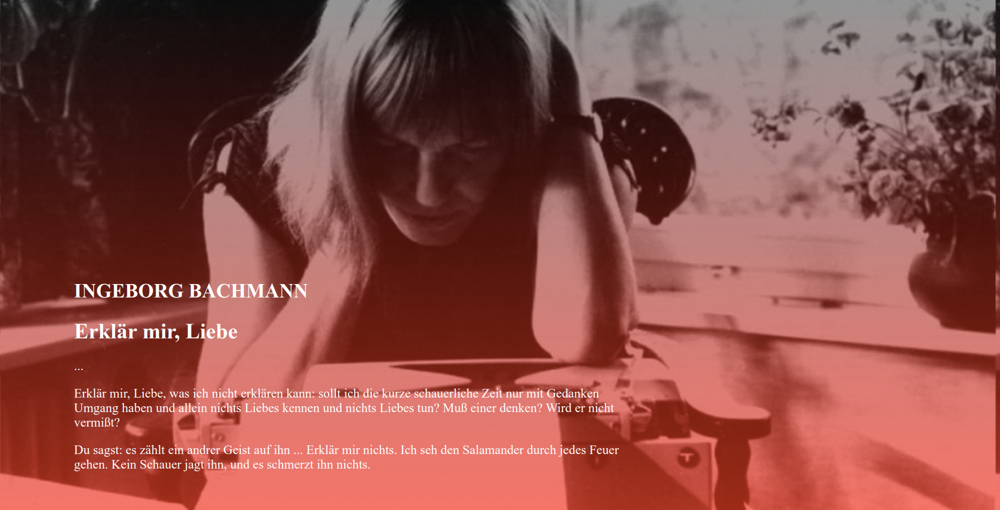

# Poetic Gradients

## Exercise Course-Module 1 - UserInterfaceBasics (UIB) - HTML/CSS

created at 18.09.2022;

solved exercise: webpage with background-images with css-gradients-effects, positioned text-div and responsive font-sizes; styled like the mockup in the images-folder

#### My desktop version:

#### My mobile version:

#### Mockup desktop

#### Mockup mobile

